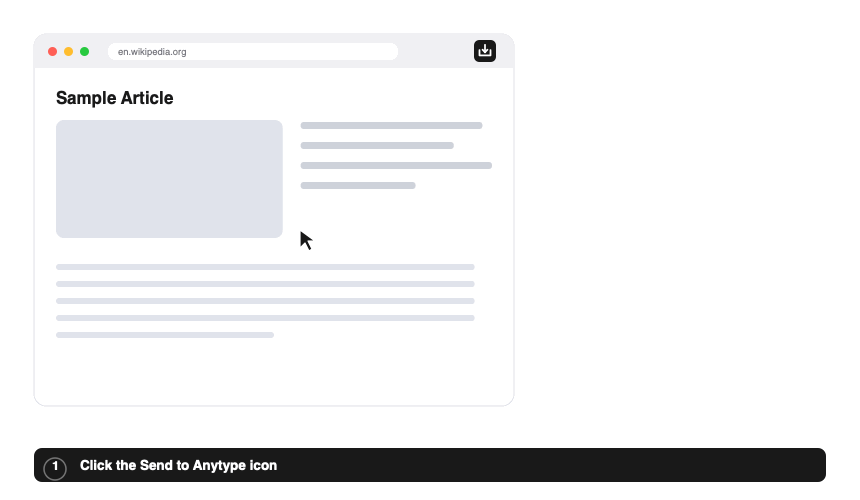

# Send to Anytype

A Safari Web Extension that lets you click images and text blocks on any
webpage and clip them into your local [Anytype](https://anytype.io) as a new
object.

Click the toolbar icon on any page, the page enters a crosshair "edit mode",
you click the images and text you want, pick the target Space and object type,
and hit **Send to Anytype**. The selection is saved as a new object whose body
is the selected text plus images (as Markdown), with a link back to the source
page.

*Illustrated walkthrough (not a screen recording).*

> Send to Anytype only talks to the Anytype Local API on
> `http://localhost:31009`, so it does nothing unless the Anytype desktop app
> is running locally.

## About Anytype

[Anytype](https://anytype.io) is the app this extension clips into — a
local-first, end-to-end-encrypted, open-source workspace for notes, documents,
and personal knowledge. Think of it as a private, offline-first alternative to
Notion: your data lives on your own device, not someone else's server. Send to
Anytype is a companion, not a replacement — it simply gives Anytype a "clip from
the web" button. Anytype is free; download the desktop app for macOS, Windows,
or Linux from the [Anytype downloads page](https://download.anytype.io/), and
keep it running for this extension to have somewhere to send clips.

---

## First run — pair with Anytype

The Anytype Local API requires a one-time pairing to mint an API key:

1. Click the **Send to Anytype** toolbar icon, then the gear (⚙) in the panel.
2. Click **Pair with Anytype…**. The Anytype desktop app pops a dialog with a
   **4-digit code**.
3. Type that code back into the panel and hit **Confirm**.

The key is stored locally (`chrome.storage.local`) and survives restarts. You
can **Unpair** any time from the same panel. After pairing, pick your target
**Space** and object **Type** (defaults to *Page*).

---

## Keyboard shortcut

Default: <kbd>⌥</kbd> <kbd>⇧</kbd> <kbd>A</kbd>. Change it under
**Safari → Settings → Extensions → Send to Anytype**.
